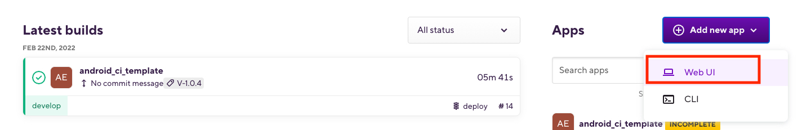
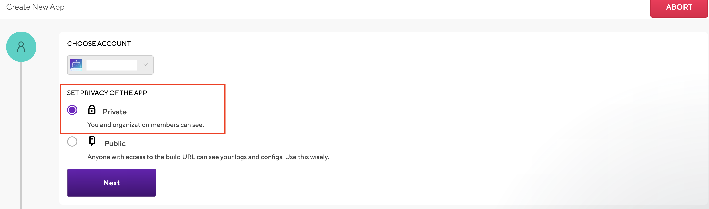
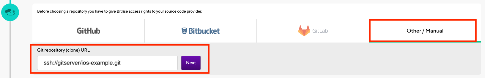

## Bitrise 設定新專案流程

### 1. 建立新專案

* [網站](https://app.bitrise.io/dashboard)
* 前往Bitrise Dashboard點選`Add new app`
* 

### 2. 選擇專案類型

* 選擇`私有`專案
* 

### 3. 設定Repository來源

* 選擇最右側的`手動設定`專案網址
* 因為Self Gitlab Server，必須使用SSH方式連線，請確認port號有打開
* 輸入`ssh://gitserver/ios-example.git`
* 

### 4. 設定Repository存取金鑰

* 複製`Bitrise SSH Key`
* 

* 到Self Gitlab Server的 `User Settings -> SSH Keys`
* 貼上SSH Key並填上Title，點擊`Add key`按鈕
* 

### 5. 設定Branch

* 輸入`Branch`名稱
* 

### 6. Bitrise首次編譯

* 確認`Bitrise`編譯結果
* 

### 7. 設定專案編譯環境

* 設定`Workspace path`
* 設定`Scheme name`
* 設定`Distribution method`
* 設定`iOS stack`
* 

### 8. 設定App icon

* 上傳要顯示專案的圖示，如果有圖示的話會自動判別出來
* 

### 9. 執行First Test Build

* 點擊First test build for you區塊進行編譯
* 
* 

### 10. 設定Build trigger API

* 點擊Dashboard專案，選擇上方Bar的`Code`區塊，下方Webhook選擇`GitLab`
* 

* 複製`Webhook URL`
* 

* 到Self Gitlab Server專案底下的`Setting -> Integrations`頁面，URL欄位貼上Webhook
* Trigger選擇`Push events`/`Tag push events`/`Merge request events`
* 
* 設定完成後，點擊`Add Webhook`按鈕

* 確認新增Webhook是否成功
* 

### 11. 設定Bitrise綁定Apple Service Connection

* 前往`App Store Connect`建立API金鑰
* 

* 點擊"+"按鈕產生API金鑰
* 名稱輸入`Bitrise-Developer`，並下載金鑰，`金鑰只能下載一次必須保存好`
* 存取權限給予`開發者`
* 

* 到Bitrise設定Apple Service Connection，在右上角帳號資訊內，點擊`Profile settings`
* 

* 點擊左側`Apple Service Connection`
* 

* 點擊`Add API key`按鈕
* 

* 參閱App Store Connect API頁面，輸入相關資料到Bitrise
* 

* 名稱輸入`Tourbobo-iOS-Developer`
* 上傳`金鑰p8檔案`
* 

* 設定完成後，點擊`Connect`按鈕
* 

### 12. 設定專案Team

* 點擊Dashboard專案，選擇上方Bar的`Team`區塊
* 

* 下方`API key authentication`選擇步驟11設定的`Tourbobo-iOS-Developer`
* 

### 13. 設定Workflows

* 進入Workflow Editor頁面，選擇上方Bar的`Workflows`區塊
* 

* 點擊"+"按鈕產生新workflow，輸入名稱並選擇基礎的workflow
* 

* 設定新建立的deploy workflow
* 刪除`Xcode Test For iOS` flow
* 新增`Certificate and profile installer` flow
* 新增`Xcode Archive & Export for iOS` flow
* 新增`Deploy to App Store Connect - Application Loader (formerly iTunes Connect)` flow
* 

* 於`Xcode Archive & Export for iOS`flow中尋找`Automatic code signing`項目，將method改為`off`，設定完成後，點擊右上角`cmd +S`按鈕儲存
* 

### 14. 設定CodeSign

* 至`Apple Developer Console` [Apple Developer Console 網址](https://idmsa.apple.com/IDMSWebAuth/signin?appIdKey=891bd3417a7776362562d2197f89480a8547b108fd934911bcbea0110d07f757&path=%2Faccount%2F&rv=1)

* 下載`Certificates`檔案，Type為`iOS Distribution`
* 

* 下載`Profiles`檔案，Type為`App Store`
* 

* 將`Certificates`檔案與`Profiles`檔案輸入到本機的keychain
* 

* 確認`Provisioning Profile`與Xcode專案內`Signing & Capabilities`設定相同
* 
* 

* 點擊Dashboard專案，選擇上方Bar的`Workflow`區塊
* 

* 進入Workflow Editor頁面，選擇上方Bar的`Code Signing`區塊
* 到`PROVISIONING PROFILE`區域，點擊下方的`Add Provisioning Profile(s)`區塊，上傳Provisioning Profile
* 

* 匯出`p12檔案`，到Xcode`Preferences -> Account`，點擊下方的`Manage Certificates`按鈕
* 

* 選擇憑證，點擊右鍵`Export Certificate`
* 

* 輸入password(此範例填寫與開發者帳號相同密碼)，點擊`Save`按鈕
* 

* 到`CODE SIGNING CERTIFICATES`區域，點擊下方的`Add a certificate(.p12 file) for code signing`區塊，上傳Certificates(上一個步驟匯出的p12檔案)
* Password欄位輸入匯出時填寫的密碼(上一個步驟填寫的)
* 

* 查看上傳Certificate與Provisioning Profile是否正確
* 

### 15. 設定Triggers

* 進入Workflow Editor頁面，選擇上方Bar的`Triggers`區塊
* 

* 選擇下方Bar的`TAG`區塊，並點擊`ADD TRIGGER`按鈕，輸入完成點擊Done按鈕
* 輸入tag名稱，並選擇要觸發的Workflow
* 

* Tag規則如下
* `V-*`，代表V-開頭的tag會觸發`deploy workflow`
* `Stage-*`，代表Stage-開頭的tag會觸發`StageDeploy workflow`
* 

### 16. 測試Push Tag 是否 Trigger Bitrise執行Workflow

* 開發分支上新增Tag名稱(此範例使用SourceTree軟體執行)，並`Push Tag`至Self Gitlab Server的專案
* 

* 點擊Dashboard專案，選擇上方Bar的`Builds`區塊，檢查是否執行對應Workflow
* 
* 
